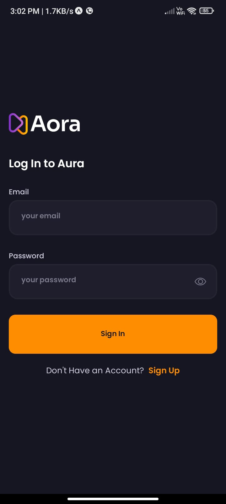
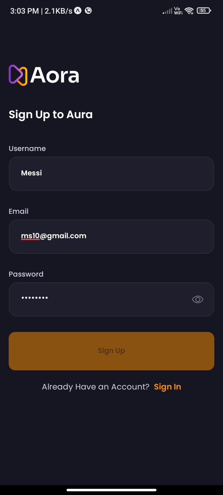
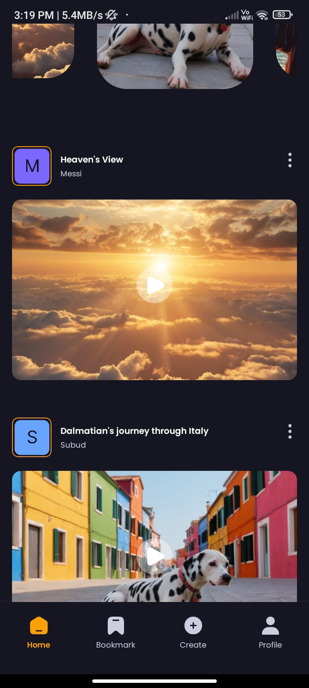
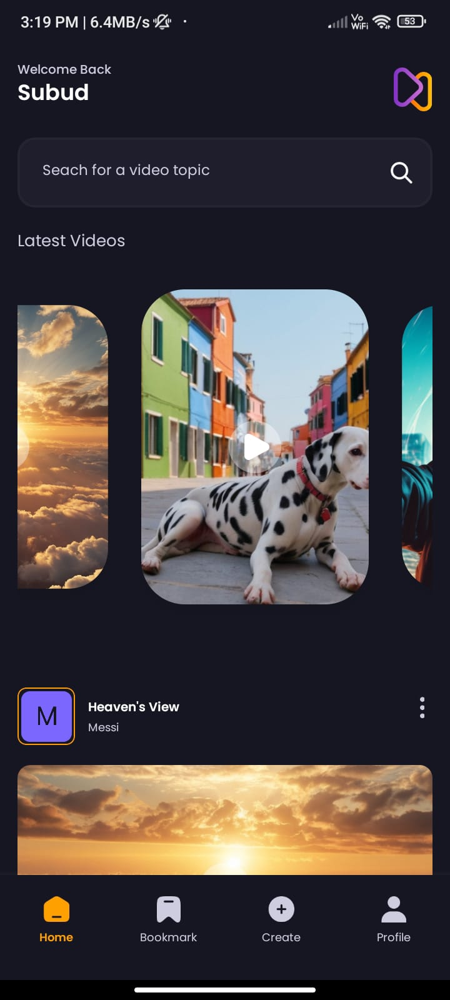

# Aora

An AI-powered video-sharing app where users can upload AI-generated videos and explore content created by others, along with the prompts used for generation.

## 🚀 Features
- 🔍 Search by video query
- 📹 Upload AI-generated videos
- 🔍 Discover and watch AI videos shared by other users
- 📝 View the exact prompts used to generate videos
- 🔑 User authentication (Sign In/Sign Up)
- 📂 User profile with uploaded videos, likes, and sign-out option

## 🛠️ Technologies Used
- **React Native** - Cross-platform mobile development
- **Expo** - Fast and easy development workflow
- **NativeWind** - Utility-first styling for React Native
- **Appwrite** - Backend services for authentication and storage

## 📸 App Screenshots

### 🏠 Welcome Screen


### 🔐 Sign In Page


### 📝 Sign Up Page


### 🏡 Home Screen


### 📜 Home Screen (Scrolled Down)


### ⬆️ Upload Screen


### 👤 Profile Screen


## 📦 Installation

1. Clone the repository:
   ```sh
   git clone https://github.com/yourusername/aora.git
   cd aora
   ```

2. Install dependencies:
   ```sh
   npm install
   ```

3. Start the app:
   ```sh
   npm run start
   ```

## 📄 License
This project is licensed under the MIT License - see the [LICENSE](LICENSE) file for details.

---

💡 Feel free to contribute! Open a PR or report issues if you have any ideas or improvements. 🚀
